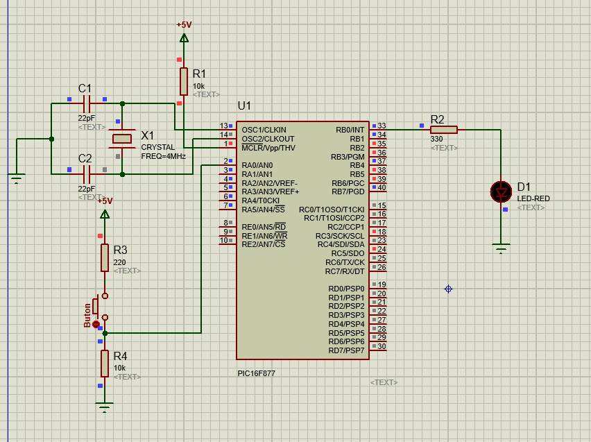
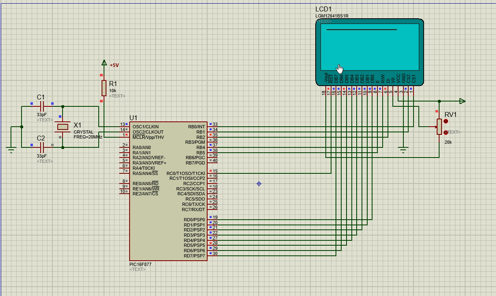

# Hoşgeldiniz!

Bu github reposu C programlama dili ile PIC programalama örnekleri barındırmaktadır.
Bu örnekler sayesinde direkt olarak yaralabilir hızlıca küçük çapta PIC çalışmaları yapabilirsinizz...

# 

# Örnekler

## Buton ile LED Kontrol Uygulaması

Bir buton kontrol edilerek işlemler yapılabilmesini sağlamaktadır.

## Grafik LCD Uygulaması

LCD üzerine yazı işlemleri ve özel fonksiyonlar ile semboller yazdırmanızı sağlamaktadır.

## Buton ile Binary Sayici uygulamasi

Buton ile binary sayici uygulamasi eklendi, butona basılması ile led ler den binary e denk gelen çıktısı
 verilmektedir.

### NOT

Dosyalar toplanarak hazırlanmıştır. örnekleştirme amacı taşımaktadır böylece hızlıca projeler geliştirme hedefini taşımaktadır.